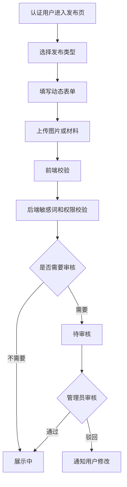
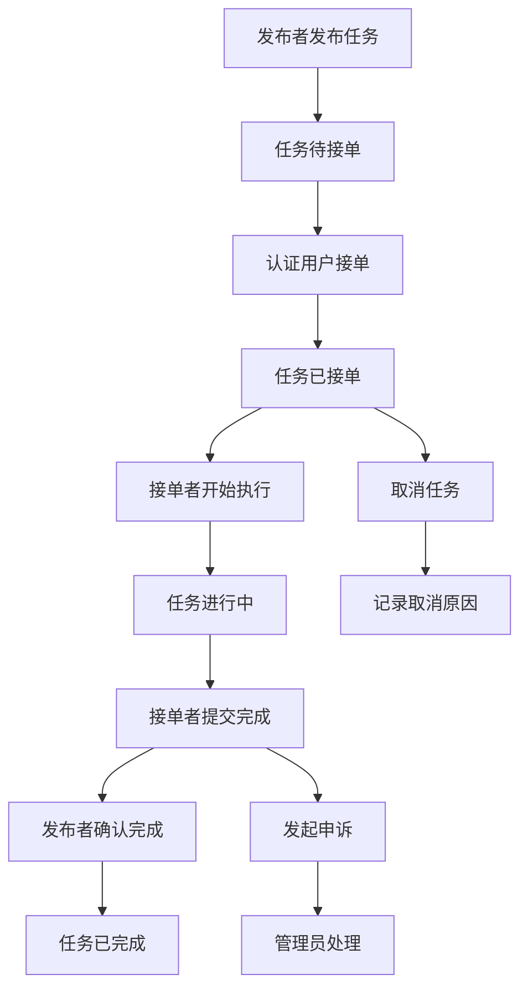
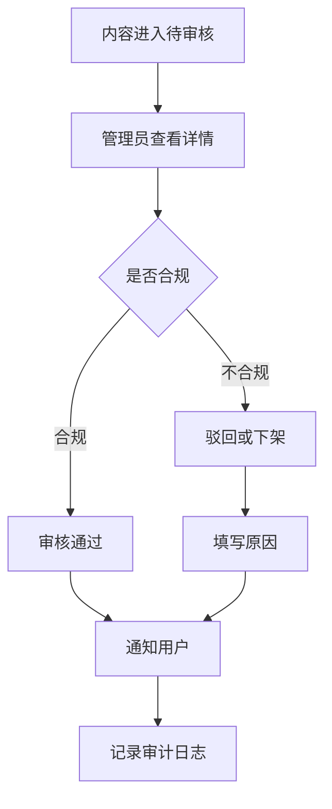

# 校园轻集市网站项目需求文档

> 文档版本：v3.0  
> 修订日期：2026-06-27  
> 项目形态：Web 网站，不做小程序、不做原生 App  
> 系统组成：前端用户端 + 前端管理端 + 后端服务 + 数据库  
> 项目定位：面向校园场景的分类信息、闲置交易与轻服务任务撮合平台

## 1. 项目概述

### 1.1 项目名称

校园轻集市

### 1.2 一句话简介

校园轻集市是一个面向本校师生的校园综合集市网站，支持闲置转让、求购交换、跑腿代取、校内送货、技能服务、失物招领等多种校园轻需求的发布、搜索、沟通、接单和管理。

### 1.3 项目边界

本项目明确建设为网站：

- 用户端：响应式 Web 网站，适配桌面端和移动浏览器。
- 管理端：Web 后台管理系统，供管理员审核、运营和处理举报。
- 后端：提供用户、认证、信息发布、任务接单、消息、举报、后台管理等 API。
- 数据库：保存用户、帖子、任务、消息、收藏、举报、评价、审核日志等核心数据。

不做：

- 不做微信小程序。
- 不做原生 iOS/Android App。
- 不做复杂 B2C 商城、仓储、物流和发票系统。
- MVP 阶段不强依赖线上支付，先完成信息撮合、线下结算和任务状态记录。

## 2. 网络平台调研与重新定位

### 2.1 参考平台

| 平台/模式 | 公开观察到的能力 | 对校园轻集市的启发 |
| --- | --- | --- |
| 闲鱼 | 官网包含登录、搜索、消息入口，并有手机、数码、电脑、服饰、运动、技能、图书、租房等大量分类 | 校园轻集市需要分类、搜索、消息和多频道信息流，不能只做二手商品 |
| Craigslist | 典型分类信息网站，页面包含 community、services、for sale、wanted、lost+found、gigs 等栏目 | 校园轻集市应采用“分类信息网站”思路，覆盖闲置、求购、服务、失物招领和临时任务 |
| Facebook Marketplace | 本地化买卖、分类浏览、联系卖家 | 校园场景应强调同校、同校区、宿舍区、教学区等本地属性 |
| Mercari | C2C 二手交易平台，强调用户快速发布与购买 | 闲置转让频道要降低发布门槛，突出图片、价格、状态和沟通 |
| Taskrabbit | 任务服务市场，用户可按价格、技能、评价选择服务者，并完成沟通、支付、评价等流程 | 跑腿、送货和技能服务需要任务字段、接单者、状态流转、评价与纠纷处理 |

### 2.2 重新定位

校园轻集市不是单一二手交易平台，而是“校园分类信息 + 校园轻服务任务”的综合网站。

核心对象拆成两类：

- 集市帖子：闲置转让、求购交换、技能服务、失物招领等偏展示和沟通的信息。
- 任务订单：跑腿代取、校内送货、代打印、临时帮忙等有明确执行过程的信息。

### 2.3 设计原则

- 网站优先：所有核心功能都通过 Web 完成。
- 校园可信：发布、接单、私信等关键操作要求校园认证。
- 多用途：二手交易只是频道之一，跑腿、送货、服务、失物招领同等重要。
- 轻量闭环：MVP 阶段不做重支付，但要做状态流转、消息、举报和后台审核。
- 前后端分离：前端负责界面和交互，后端提供 REST API，数据库保存业务数据。

## 3. 用户角色

| 角色 | 描述 | 主要权限 |
| --- | --- | --- |
| 游客 | 未登录用户 | 浏览公开首页、频道列表、详情部分信息 |
| 注册用户 | 已注册但未认证 | 浏览、收藏、提交校园认证 |
| 认证用户 | 完成校园认证的学生或校内人员 | 发布信息、发布任务、联系他人、接单、举报、评价 |
| 发布者 | 发布帖子或任务的人 | 管理自己的发布、确认任务完成、处理沟通 |
| 接单者 | 接受跑腿、送货、技能服务任务的人 | 接单、更新任务状态、提交完成 |
| 管理员 | 平台管理人员 | 审核认证、审核帖子、处理举报、管理分类、查看数据 |

## 4. 核心业务场景

### 4.1 闲置转让

用户发布教材、数码配件、自行车、台灯、宿舍用品等闲置物品。买家通过分类、价格、校区、关键词筛选，查看详情后站内联系，线下面交后发布者标记成交。

### 4.2 求购交换

用户发布想买、想换、想租借的信息，例如教材、计算器、活动服装、临时工具。其他用户可主动联系并协商。

### 4.3 跑腿代取

用户发布代取快递、代买饭、代打印、代拿资料等任务，填写取货点、送达点、截止时间和报酬。认证用户接单后更新任务状态，完成后由发布者确认。

### 4.4 校内送货

用户需要把物品从宿舍楼送到教学楼、从快递站送到寝室、从一个校区送到另一个校区。系统记录取件点、送达点、物品类型、报酬和任务状态。

### 4.5 技能服务

用户发布 PPT 美化、简历修改、摄影修图、电脑维修、课程辅导等技能服务。其他用户通过服务详情联系发布者。

### 4.6 失物招领

用户发布丢失或捡到的校园卡、耳机、钥匙、书本等信息。系统支持按地点、时间、物品类型搜索。

## 5. 总体系统架构

```text
浏览器
├── 用户端前端 Web
│   ├── 首页/频道/搜索/详情/发布/消息/个人中心
│   └── 调用后端 REST API
├── 管理端前端 Web
│   ├── 数据看板/审核/举报/用户/分类/公告
│   └── 调用后端管理 API
└── 后端服务
    ├── 用户与认证模块
    ├── 帖子与分类模块
    ├── 跑腿任务模块
    ├── 消息与通知模块
    ├── 收藏与浏览历史模块
    ├── 举报与风控模块
    ├── 后台管理模块
    └── 文件上传模块
        ├── MySQL 数据库
        ├── Redis 缓存
        └── 本地/对象存储
```

## 6. 前端需求

### 6.1 用户端页面

| 页面 | 功能 |
| --- | --- |
| 首页 | 顶部导航、搜索框、频道入口、推荐信息流、急单任务、安全提示 |
| 频道页 | 闲置、求购、跑腿、送货、服务、失物招领分频道展示 |
| 搜索结果页 | 关键词搜索、频道筛选、校区筛选、价格/报酬筛选、状态筛选、排序 |
| 详情页 | 展示帖子或任务详情，支持收藏、联系、举报、接单、状态操作 |
| 发布页 | 先选择发布类型，再动态展示对应表单字段 |
| 消息页 | 展示会话列表和聊天内容，关联具体帖子或任务 |
| 个人中心 | 我的发布、我的任务、我的接单、我的收藏、认证状态、设置 |
| 登录注册页 | 账号登录、注册、退出登录 |
| 校园认证页 | 提交学号、姓名、校园邮箱或学生证材料 |

### 6.2 管理端页面

| 页面 | 功能 |
| --- | --- |
| 登录页 | 管理员登录 |
| 数据看板 | 用户数、帖子数、任务数、待审核数、举报数、完成数 |
| 用户管理 | 查看用户、认证状态、禁言、封禁、解封 |
| 认证审核 | 查看认证材料，通过或驳回 |
| 帖子管理 | 审核、下架、删除、推荐、修改分类 |
| 任务管理 | 查看任务状态、处理异常任务、处理申诉 |
| 举报管理 | 查看举报、处理举报、记录处理结果 |
| 分类管理 | 新增、编辑、排序、禁用分类 |
| 公告管理 | 发布、编辑、下线公告 |
| 操作日志 | 查看管理员关键操作记录 |

### 6.3 前端交互要求

- 响应式布局，桌面端和手机浏览器均可使用。
- 发布表单根据类型动态变化。
- 搜索和筛选支持组合条件。
- 任务状态变化要有明显提示。
- 操作成功或失败要有 toast/message 提示。
- 空状态提供引导，例如“发布第一个任务”。
- 表单校验在前端即时提示，后端再次校验。
- 按钮、输入框、弹窗需支持键盘焦点和基础可访问性。

### 6.4 前端技术建议

课程项目可选：

- Vue 3 + Vite + Vue Router + Pinia + Axios。
- 管理端可使用 Element Plus。
- 用户端可使用原生 CSS 或 Tailwind CSS。

如果项目规模较小，也可先用 HTML + CSS + JavaScript 完成原型，再逐步迁移到 Vue。

## 7. 后端需求

### 7.1 后端模块

| 模块 | 说明 |
| --- | --- |
| 用户模块 | 注册、登录、退出、个人资料、账号状态 |
| 校园认证模块 | 提交认证、审核认证、认证状态控制 |
| 分类模块 | 管理频道、一级分类、二级分类 |
| 集市帖子模块 | 闲置、求购、技能服务、失物招领的发布、编辑、查询、下架 |
| 跑腿任务模块 | 跑腿、送货任务的发布、接单、状态流转、取消、完成 |
| 消息模块 | 会话、消息发送、消息已读 |
| 收藏模块 | 收藏、取消收藏、收藏列表 |
| 浏览历史模块 | 记录浏览行为，用于个人历史和热度统计 |
| 举报模块 | 举报帖子、任务、用户、消息 |
| 评价模块 | 交易评价、任务评价、服务评价 |
| 通知模块 | 审核结果、被接单、状态变化、举报结果 |
| 文件模块 | 图片上传、图片访问、文件类型校验 |
| 后台管理模块 | 管理员登录、审核、处理、统计 |
| 风控模块 | 敏感词、发布频率、重复内容、违规处理 |

### 7.2 后端接口风格

采用 RESTful API，返回 JSON。

统一响应格式：

```json
{
  "code": 0,
  "message": "ok",
  "data": {}
}
```

分页响应格式：

```json
{
  "code": 0,
  "message": "ok",
  "data": {
    "records": [],
    "page": 1,
    "pageSize": 20,
    "total": 100
  }
}
```

### 7.3 核心 API 草案

#### 7.3.1 用户与认证

| 方法 | 路径 | 说明 |
| --- | --- | --- |
| POST | `/api/auth/register` | 用户注册 |
| POST | `/api/auth/login` | 用户登录 |
| POST | `/api/auth/logout` | 退出登录 |
| GET | `/api/users/me` | 获取当前用户 |
| PUT | `/api/users/me` | 修改个人资料 |
| POST | `/api/verifications` | 提交校园认证 |
| GET | `/api/verifications/me` | 查看我的认证状态 |
| POST | `/api/admin/verifications/{id}/approve` | 管理员通过认证 |
| POST | `/api/admin/verifications/{id}/reject` | 管理员驳回认证 |

#### 7.3.2 集市帖子

| 方法 | 路径 | 说明 |
| --- | --- | --- |
| GET | `/api/listings` | 帖子列表，支持搜索和筛选 |
| GET | `/api/listings/{id}` | 帖子详情 |
| POST | `/api/listings` | 发布帖子 |
| PUT | `/api/listings/{id}` | 编辑自己的帖子 |
| POST | `/api/listings/{id}/offline` | 下架自己的帖子 |
| POST | `/api/listings/{id}/complete` | 标记完成或成交 |
| POST | `/api/listings/{id}/favorite` | 收藏 |
| DELETE | `/api/listings/{id}/favorite` | 取消收藏 |

#### 7.3.3 跑腿和送货任务

| 方法 | 路径 | 说明 |
| --- | --- | --- |
| GET | `/api/tasks` | 任务列表 |
| GET | `/api/tasks/{id}` | 任务详情 |
| POST | `/api/tasks` | 发布任务 |
| POST | `/api/tasks/{id}/accept` | 接单 |
| POST | `/api/tasks/{id}/start` | 开始执行 |
| POST | `/api/tasks/{id}/submit-complete` | 接单者提交完成 |
| POST | `/api/tasks/{id}/confirm-complete` | 发布者确认完成 |
| POST | `/api/tasks/{id}/cancel` | 取消任务 |
| POST | `/api/tasks/{id}/appeal` | 发起申诉 |

#### 7.3.4 消息、举报、评价

| 方法 | 路径 | 说明 |
| --- | --- | --- |
| GET | `/api/conversations` | 会话列表 |
| GET | `/api/conversations/{id}/messages` | 消息列表 |
| POST | `/api/messages` | 发送消息 |
| POST | `/api/reports` | 提交举报 |
| GET | `/api/reviews/target/{targetId}` | 查看评价 |
| POST | `/api/reviews` | 提交评价 |

#### 7.3.5 后台管理

| 方法 | 路径 | 说明 |
| --- | --- | --- |
| GET | `/api/admin/dashboard` | 数据看板 |
| GET | `/api/admin/users` | 用户列表 |
| POST | `/api/admin/users/{id}/ban` | 封禁用户 |
| POST | `/api/admin/users/{id}/unban` | 解封用户 |
| GET | `/api/admin/listings` | 帖子管理列表 |
| POST | `/api/admin/listings/{id}/approve` | 审核通过帖子 |
| POST | `/api/admin/listings/{id}/reject` | 驳回帖子 |
| POST | `/api/admin/listings/{id}/remove` | 下架帖子 |
| GET | `/api/admin/reports` | 举报列表 |
| POST | `/api/admin/reports/{id}/handle` | 处理举报 |
| GET | `/api/admin/categories` | 分类管理 |
| POST | `/api/admin/categories` | 新增分类 |
| PUT | `/api/admin/categories/{id}` | 编辑分类 |

### 7.4 后端技术建议

当前项目实际技术栈：

- 前端：Vue 3 + Vite。
- 后端：Node.js + Express。
- 数据库：MySQL 8，使用 `app_state` 作为运行态主数据源，并同步镜像到标准业务表。

可选扩展技术栈：

- Java：Spring Boot 3 + MyBatis Plus + MySQL + Redis。
- 或 Node.js：NestJS + Prisma + MySQL/PostgreSQL + Redis。

建议优先选择团队熟悉的技术。若后续重构为 Java，整体更适合课程答辩中的分层架构展示；当前版本以 Express REST API 完成功能闭环。

## 8. 数据库设计

### 8.1 数据库选型

MVP 推荐 MySQL 8。

当前实现说明：系统以 `app_state` 表保存完整运行态数据，后端每次写入后同步到 `user`、`listing`、`task_order`、`message`、`announcement` 等标准业务表。Navicat 查看标准表时需要手动刷新，直接修改标准业务表不会反向同步到前端。

可选辅助组件：

- Redis：登录 Token、验证码、热点数据、发布频率限制。
- 对象存储或本地文件目录：保存商品图片、认证材料、完成凭证。

### 8.2 核心实体关系

```text
user 1 ── n listing
user 1 ── n task_order
user 1 ── n favorite
user 1 ── n report
user 1 ── n review
category 1 ── n listing
listing 1 ── n listing_image
task_order 1 ── n task_status_log
conversation 1 ── n message
admin_user 1 ── n audit_log
```

### 8.3 数据表设计

#### 8.3.1 用户表 `user`

| 字段 | 类型 | 说明 |
| --- | --- | --- |
| id | bigint | 主键 |
| username | varchar(50) | 用户名 |
| password_hash | varchar(255) | 密码哈希 |
| nickname | varchar(50) | 昵称 |
| avatar_url | varchar(255) | 头像 |
| phone | varchar(30) | 手机号，建议加密或脱敏 |
| email | varchar(100) | 邮箱 |
| school_id | bigint | 学校 ID |
| campus_id | bigint | 校区 ID |
| verify_status | tinyint | 0 未认证，1 待审核，2 已认证，3 驳回 |
| credit_score | int | 信用分 |
| status | tinyint | 0 正常，1 禁言，2 封禁，3 注销 |
| created_at | datetime | 创建时间 |
| updated_at | datetime | 更新时间 |

#### 8.3.2 校园认证表 `campus_verification`

| 字段 | 类型 | 说明 |
| --- | --- | --- |
| id | bigint | 主键 |
| user_id | bigint | 用户 ID |
| real_name | varchar(50) | 真实姓名 |
| student_no | varchar(50) | 学号 |
| method | varchar(30) | 学号、邮箱、学生证等 |
| proof_url | varchar(255) | 证明材料 |
| status | tinyint | 待审核、通过、驳回 |
| reject_reason | varchar(255) | 驳回原因 |
| reviewed_by | bigint | 审核管理员 ID |
| reviewed_at | datetime | 审核时间 |
| created_at | datetime | 创建时间 |

#### 8.3.3 分类表 `category`

| 字段 | 类型 | 说明 |
| --- | --- | --- |
| id | bigint | 主键 |
| parent_id | bigint | 父分类 ID |
| channel | varchar(30) | idle、wanted、task、delivery、service、lost |
| name | varchar(50) | 分类名称 |
| sort_order | int | 排序 |
| status | tinyint | 启用、禁用 |
| created_at | datetime | 创建时间 |

#### 8.3.4 集市帖子表 `listing`

用于闲置转让、求购交换、技能服务、失物招领。

| 字段 | 类型 | 说明 |
| --- | --- | --- |
| id | bigint | 主键 |
| publisher_id | bigint | 发布者 ID |
| channel | varchar(30) | idle、wanted、service、lost |
| category_id | bigint | 分类 ID |
| title | varchar(80) | 标题 |
| description | text | 描述 |
| price | decimal(10,2) | 商品或服务价格 |
| budget_min | decimal(10,2) | 求购预算下限 |
| budget_max | decimal(10,2) | 求购预算上限 |
| condition_level | varchar(30) | 新旧程度 |
| campus_id | bigint | 校区 ID |
| location_text | varchar(120) | 交易或服务地点 |
| trade_method | varchar(30) | 面交、自提、线上等 |
| contact_mode | varchar(30) | 站内、电话可见等 |
| status | tinyint | 待审核、展示中、已预订、已完成、已下架、驳回 |
| view_count | int | 浏览量 |
| favorite_count | int | 收藏数 |
| created_at | datetime | 创建时间 |
| updated_at | datetime | 更新时间 |

#### 8.3.5 帖子图片表 `listing_image`

| 字段 | 类型 | 说明 |
| --- | --- | --- |
| id | bigint | 主键 |
| listing_id | bigint | 帖子 ID |
| image_url | text | 图片地址或 base64 图片数据 |
| sort_order | int | 排序 |
| created_at | datetime | 创建时间 |

#### 8.3.6 任务表 `task_order`

用于跑腿代取和校内送货。

| 字段 | 类型 | 说明 |
| --- | --- | --- |
| id | bigint | 主键 |
| publisher_id | bigint | 发布者 ID |
| taker_id | bigint | 接单者 ID，可为空 |
| task_type | varchar(30) | pickup、delivery、print、buy、other |
| title | varchar(80) | 任务标题 |
| description | text | 任务说明 |
| pickup_location | varchar(120) | 取货点 |
| delivery_location | varchar(120) | 送达点 |
| campus_id | bigint | 校区 ID |
| reward | decimal(10,2) | 报酬 |
| deadline_at | datetime | 截止时间 |
| item_note | varchar(255) | 物品说明 |
| proof_required | tinyint | 是否需要完成凭证 |
| status | tinyint | 待审核、待接单、已接单、进行中、待确认、已完成、已取消、申诉中 |
| cancel_reason | varchar(255) | 取消原因 |
| completed_at | datetime | 完成时间 |
| created_at | datetime | 创建时间 |
| updated_at | datetime | 更新时间 |

#### 8.3.7 任务状态日志表 `task_status_log`

| 字段 | 类型 | 说明 |
| --- | --- | --- |
| id | bigint | 主键 |
| task_id | bigint | 任务 ID |
| operator_id | bigint | 操作人 ID |
| from_status | tinyint | 变更前状态 |
| to_status | tinyint | 变更后状态 |
| remark | varchar(255) | 备注 |
| created_at | datetime | 创建时间 |

#### 8.3.8 会话表 `conversation`

| 字段 | 类型 | 说明 |
| --- | --- | --- |
| id | bigint | 主键 |
| target_type | varchar(30) | listing 或 task |
| target_id | bigint | 关联帖子或任务 ID |
| buyer_id | bigint | 发起方 |
| seller_id | bigint | 接收方 |
| last_message | varchar(255) | 最近消息 |
| last_message_at | datetime | 最近消息时间 |
| created_at | datetime | 创建时间 |

#### 8.3.9 消息表 `message`

| 字段 | 类型 | 说明 |
| --- | --- | --- |
| id | bigint | 主键 |
| conversation_id | bigint | 会话 ID |
| sender_id | bigint | 发送者 ID |
| content | text | 消息内容 |
| message_type | varchar(20) | text、image、system |
| read_status | tinyint | 未读、已读 |
| created_at | datetime | 创建时间 |

#### 8.3.10 收藏表 `favorite`

| 字段 | 类型 | 说明 |
| --- | --- | --- |
| id | bigint | 主键 |
| user_id | bigint | 用户 ID |
| target_type | varchar(30) | listing 或 task |
| target_id | bigint | 目标 ID |
| created_at | datetime | 创建时间 |

#### 8.3.11 举报表 `report`

| 字段 | 类型 | 说明 |
| --- | --- | --- |
| id | bigint | 主键 |
| reporter_id | bigint | 举报人 |
| target_type | varchar(30) | user、listing、task、message |
| target_id | bigint | 目标 ID |
| reason | varchar(100) | 举报原因 |
| description | text | 补充说明 |
| evidence_url | varchar(255) | 证据图片 |
| status | tinyint | 待处理、已处理、驳回 |
| handled_by | bigint | 处理管理员 |
| handled_at | datetime | 处理时间 |
| handle_result | varchar(255) | 处理结果 |
| created_at | datetime | 创建时间 |

#### 8.3.12 评价表 `review`

| 字段 | 类型 | 说明 |
| --- | --- | --- |
| id | bigint | 主键 |
| reviewer_id | bigint | 评价人 |
| target_user_id | bigint | 被评价用户 |
| target_type | varchar(30) | listing 或 task |
| target_id | bigint | 关联目标 ID |
| rating | tinyint | 1 到 5 分 |
| content | varchar(255) | 评价内容 |
| created_at | datetime | 创建时间 |

#### 8.3.13 通知表 `notification`

| 字段 | 类型 | 说明 |
| --- | --- | --- |
| id | bigint | 主键 |
| user_id | bigint | 接收用户 |
| title | varchar(100) | 通知标题 |
| content | varchar(255) | 通知内容 |
| read_status | tinyint | 未读、已读 |
| created_at | datetime | 创建时间 |

#### 8.3.14 公告表 `announcement`

| 字段 | 类型 | 说明 |
| --- | --- | --- |
| id | bigint | 主键 |
| title | varchar(100) | 公告标题 |
| content | text | 公告内容 |
| level | varchar(30) | 公告级别 |
| status | tinyint | 正常、下线 |
| created_at | datetime | 创建时间 |

#### 8.3.15 管理员与日志表

`admin_user`：

| 字段 | 类型 | 说明 |
| --- | --- | --- |
| id | bigint | 主键 |
| username | varchar(50) | 管理员账号 |
| password_hash | varchar(255) | 密码哈希 |
| role | varchar(30) | admin、super_admin |
| status | tinyint | 正常、禁用 |
| created_at | datetime | 创建时间 |

`admin_audit_log`：

| 字段 | 类型 | 说明 |
| --- | --- | --- |
| id | bigint | 主键 |
| admin_id | bigint | 管理员 ID |
| action | varchar(50) | 操作类型 |
| target_type | varchar(30) | 操作对象类型 |
| target_id | bigint | 操作对象 ID |
| detail | text | 操作详情 |
| created_at | datetime | 创建时间 |

## 9. 主要业务流程

### 9.1 发帖流程



### 9.2 跑腿任务流程



### 9.3 管理审核流程



## 10. 功能需求

### 10.1 登录注册

- 支持用户名/手机号/邮箱注册。
- 密码使用 `scrypt` 哈希存储；旧演示明文账号由后端自动升级为哈希。
- 登录后返回 Token 或创建 Session。
- 后端需要校验用户状态，封禁用户不能登录或发布。

### 10.2 校园认证

- 支持学号 + 姓名认证。
- 可扩展校园邮箱认证、学生证图片审核。
- 未认证用户不能发布、接单和私信。
- 认证材料仅后台可见，前台不展示学号和真实姓名。

### 10.3 分类与频道

一级频道：

- 闲置转让。
- 求购交换。
- 跑腿代取。
- 校内送货。
- 技能服务。
- 失物招领。
- 校园互助。

每个频道支持独立分类、筛选字段和发布表单。

### 10.4 闲置转让

- 发布商品标题、图片、分类、描述、价格、新旧程度、交易地点。
- 支持搜索、筛选、收藏、联系、举报。
- 状态包括待审核、在售、已预订、已成交、已下架。

### 10.5 求购交换

- 发布求购标题、预算、可接受成色、期望地点、是否接受交换。
- 支持其他用户联系发布者。
- 状态包括展示中、已解决、已下架。

### 10.6 跑腿代取与校内送货

- 发布任务标题、取货点、送达点、截止时间、报酬、物品说明。
- 支持接单、开始执行、提交完成、确认完成、取消、申诉。
- 同一任务同一时间只能一个人接单。
- 发布者不能接自己的任务。
- 接单后核心字段不能随意修改。

### 10.7 技能服务

- 发布服务内容、价格、服务时间、服务方式、服务地点。
- 支持联系、收藏、评价。
- 可作为帖子处理，也可后续扩展为预约订单。

### 10.8 失物招领

- 支持发布失物或招领。
- 字段包括物品名称、地点、时间、特征、图片。
- 可按地点和时间筛选。

### 10.9 消息沟通

- 用户可围绕某个帖子或任务发起会话。
- 会话中展示关联卡片。
- 支持文本消息，后续可扩展图片消息。
- 对联系方式、转账、违规词做风险提示。

### 10.10 举报与风控

- 支持举报用户、帖子、任务、消息。
- 举报达到阈值后可自动隐藏内容，等待管理员复核。
- 后台处理结果需要通知举报人和被举报人。

## 11. 权限规则

| 功能 | 游客 | 注册未认证 | 认证用户 | 管理员 |
| --- | --- | --- | --- | --- |
| 浏览首页 | 可 | 可 | 可 | 可 |
| 搜索筛选 | 可 | 可 | 可 | 可 |
| 收藏 | 不可 | 可 | 可 | 可 |
| 发布帖子 | 不可 | 不可 | 可 | 可 |
| 发布任务 | 不可 | 不可 | 可 | 可 |
| 接单 | 不可 | 不可 | 可 | 可 |
| 私信 | 不可 | 不可 | 可 | 可 |
| 举报 | 不可 | 可 | 可 | 可 |
| 审核内容 | 不可 | 不可 | 不可 | 可 |
| 管理分类 | 不可 | 不可 | 不可 | 可 |

## 12. 禁售与禁发规则

### 12.1 禁售

- 违法违规物品。
- 烟酒、药品、医疗器械。
- 管制刀具、易燃易爆物品。
- 盗版、外挂、账号交易。
- 身份证、学生证、校园卡账号、银行卡。
- 无法证明来源的贵重物品。
- 有安全或卫生风险的食品、开封化妆品等。

### 12.2 禁发任务

- 代考、代课、代签到、代写作业、代写论文。
- 涉及违法违规或违反校规校纪的委托。
- 携带危险品、违禁品的送货任务。
- 跟踪、偷拍、骚扰、侵犯隐私类任务。
- 诱导提前转账、刷单、套现、账号交易。

## 13. 非功能需求

### 13.1 性能

- 首页首屏加载目标不超过 2 秒。
- 列表分页，每页 10 到 20 条。
- 搜索响应目标不超过 1 秒。
- 图片使用压缩和懒加载。
- 高频列表可使用 Redis 缓存。

### 13.2 安全

- 密码使用哈希存储。
- 后端接口必须鉴权。
- 管理端接口必须校验管理员权限。
- 用户不能修改他人帖子或任务。
- 接单接口需要事务或乐观锁，避免多人同时接单。
- 上传文件限制类型和大小。
- 敏感个人信息脱敏展示。

### 13.3 可用性

- 响应式布局，移动端可正常发布和接单。
- 表单错误提示明确。
- 发布失败保留已填写内容。
- 任务状态变化有明确反馈。
- 空状态有下一步引导。

### 13.4 可维护性

- 前后端分离。
- 后端按模块分层：Controller、Service、Mapper/Repository。
- 数据库字段命名统一。
- 关键枚举集中管理。
- API 文档可用 Swagger/OpenAPI 生成。

## 14. 测试与验收

### 14.1 前端验收

- 首页、频道页、详情页、发布页、个人中心、管理后台可访问。
- 搜索、筛选、排序能正确联动。
- 发布表单能根据类型展示不同字段。
- 手机浏览器和桌面浏览器布局不溢出。

### 14.2 后端验收

- 登录、注册、认证、发布、查询、接单、消息、举报 API 可用。
- 未认证用户无法发布和接单。
- 用户无法编辑他人内容。
- 管理员接口普通用户无法访问。
- 任务不能被多人同时接单。

### 14.3 数据库验收

- 核心表能正常创建。
- 发帖、发任务、接单、收藏、举报、评价能落库。
- 外键或逻辑关联正确。
- 重要查询字段建立索引。

建议索引：

- `listing(channel, status, campus_id, created_at)`
- `listing(title)`
- `task_order(status, campus_id, deadline_at)`
- `task_order(publisher_id, taker_id)`
- `message(conversation_id, created_at)`
- `favorite(user_id, target_type, target_id)`
- `report(status, target_type, target_id)`

## 15. 开发里程碑

| 阶段 | 前端任务 | 后端任务 | 数据库任务 | 交付物 |
| --- | --- | --- | --- | --- |
| 第 1 周 | 需求确认、页面结构 | 技术选型、接口草案 | ER 图草案 | 需求文档、原型图 |
| 第 2 周 | 首页、频道页、详情页 | 用户、登录、认证接口 | 用户和认证表 | 可浏览页面 |
| 第 3 周 | 发布页、个人中心 | 帖子和分类接口 | 帖子、分类、图片表 | 帖子发布闭环 |
| 第 4 周 | 跑腿任务页 | 任务发布和接单接口 | 任务和状态日志表 | 跑腿任务闭环 |
| 第 5 周 | 消息、收藏、举报页面 | 消息、收藏、举报接口 | 消息、收藏、举报表 | 沟通与风控闭环 |
| 第 6 周 | 管理后台 | 后台审核和管理接口 | 管理员和日志表 | 管理后台 |
| 第 7 周 | UI 优化、响应式 | 性能、安全、异常处理 | 索引和测试数据 | 联调版本 |
| 第 8 周 | 演示整理 | 部署配置 | 数据备份脚本 | 答辩版本 |

## 16. 技术栈推荐

### 16.1 推荐方案 A：Java 后端

- 前端用户端：Vue 3 + Vite + Vue Router + Pinia + Axios。
- 前端管理端：Vue 3 + Element Plus。
- 后端：Spring Boot 3 + MyBatis Plus。
- 数据库：MySQL 8。
- 缓存：Redis。
- 文档：Swagger/OpenAPI。

### 16.2 可选方案 B：Node 后端

- 前端：Vue 3 或 React。
- 后端：NestJS。
- ORM：Prisma。
- 数据库：MySQL 或 PostgreSQL。
- 缓存：Redis。

课程项目更建议使用方案 A，结构清晰，便于展示前后端分离、数据库设计和后台管理。

## 17. 参考资料

- 闲鱼官网：https://www.goofish.com/
- Craigslist 分类信息网站：https://sfbay.craigslist.org/
- Facebook Marketplace：https://www.facebook.com/marketplace/learn-more
- Mercari：https://www.mercari.com/
- Taskrabbit：https://www.taskrabbit.com/
- Bootstrap 响应式断点：https://getbootstrap.com/docs/5.3/layout/breakpoints/
- Material Design 自适应设计：https://m3.material.io/foundations/adaptive-design/overview
